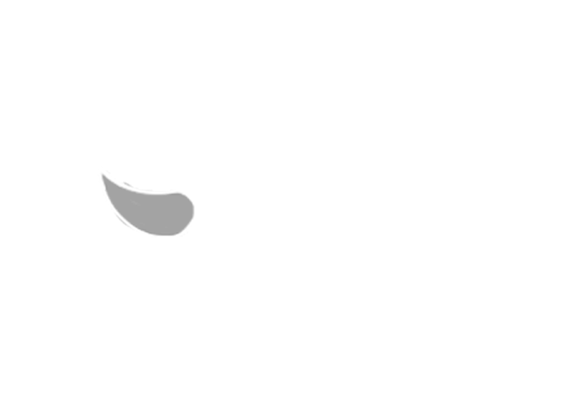
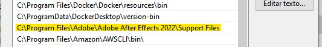

<div id="top"></div>

<br />
<div align="center">
  <a href="https://github.com/wltjunior92/podcast-cuts-creator">
    
  </a>

  <h3 align="center">Short Cuts - Node.js Youtube podcast cuts editor</h3>

  <p align="center">
    A concept proof based on<br />
    <a href="https://github.com/filipedeschamps/video-maker">Filipe Deschamps Video maker</a><br />
    robot!
  </p>
  
</div>
<br />
<p align="left">
  Youtube channel with videos generated with this project<br />
  <a href="https://www.youtube.com/channel/UCo6kLVgGrTFLIXYGgKsoo_w">Short Cuts - Podcast</a>
</p>
<br />
<br />

<details>
  <summary>Table of Contents</summary>
  <ol>
    <li>
      <a href="#about-the-project">About The Project</a>
      <ul>
        <li><a href="#built-with">Built With</a></li>
      </ul>
    </li>
    <li>
      <a href="#getting-started">Getting Started</a>
      <ul>
        <li><a href="#important">Important</a></li>
      </ul>
    </li>
    <li><a href="#possible-improvements-and-bug-corrections">Possible improvements and bug corrections</a></li>
  </ol>
</details>


<!-- ABOUT THE PROJECT -->
## About The Project

This project was build when I realize that there is a very common pattern on the kind of videos on youtube podcast cuts channel.

It's aways some kind of intro and an ending showing some kind of sponsor of the channel, etc.

So how could I automate all this editing process?

With this project you can automate processes like:
* Download a youtube video source;
* Edit an output video from an AfterEffects template by de command line;
* Extract some images from the source video to use as thumbnail;
* Edit this thumbnails scripting with Photoshop;
* Extract infos from the source video url to create your own Video Description;
* Organize the assets and the rendered files on separated folders;

PS.: I tried to code using the best practices and I know that maybe I've failed miserably 😅.

PS2.: I made this project using windows and if you want to run it in othes OS you will need to make all the changes you find necessary.

PS3.: I bought an Xbox 360 🎮 instead of it when I had the chance, so I never played it 😢.

<p align="right">(<a href="#top">back to top</a>)</p>

### Built With

The technologies and programs that I used in this project:

* [Node.js](https://nodejs.org/)
* [Typescript](https://www.typescriptlang.org/)
* [AfterEffects](https://www.adobe.com/aftereffects)
* [Photoshop](https://www.adobe.com/photoshop)

<p align="right">(<a href="#top">back to top</a>)</p>

## Getting Started

You will have to clone this project and install all dependencies:
* clone
  ```sh
  git clone https://github.com/wltjunior92/podcast-cuts-creator.git
  ```

* npm
  ```sh
  npm install
  ```

* Or use yarn
  ```sh
  yarn
  ```

You will probably need to add the path to your AfterEffects Suport Files folder at Environment variables to have the `aerender` and `afterfx` commands available on command line.



<strong>You will probabli need to install the [Voukoder](https://www.voukoder.org/forum/thread/783-downloads-instructions/) to make AfterEffects robot editor works correctly, so it can render an mp4 output directly from the AfterEffects render queue.</strong>

After this, you will need to run the command `start` on your project to begin the process.

And now you just need to paste an youtube url from a podcast cut channel, write the click bait text that goes on the thumbnail, confirm and let the "magic" happen 🤷‍♂️.

### Important

I didn't figure out how to run Photoshop the same way as AfterEfects, from the command line, so , when the step that uses photoshop begin, if the Photoshop window doesn't come to the foreground you will have to do it by hand wait some seconds to let the vbs script navigate to the menu item that will run the photoshop script.

PS.: During this process you need to avoid clicking or swiching the window.


## Possible improvements and bug corrections

- [ ] Automatic Youtube upload video and thumbnail (it was made on the [Video Maker](https://github.com/filipedeschamps/video-maker))
- [ ] Add the possibility to insert an array of youtube url to make more than one video per command

<p align="right">(<a href="#top">back to top</a>)</p>


## License

Distributed under the MIT License.

<p align="right">(<a href="#top">back to top</a>)</p>
